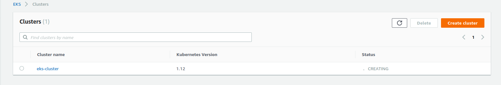

### Kubernetes Zero Downtime Deployment with Auto Scaling of Worker nodes on 
### Amazon Web Service EKS Managed master

###  What this repository provides    

     -  Create A VPC
     -  Add Subnets to the VPC
     -  Setup Secruity Groups for the Master
     -  Create roles to grant access to provision Kubernetes on AWS
     -  Attach roles to provide access to provision
     -  Create roles for Worker nodes
     -  Attach roles to policy with EC2 assume role

####   Setup a Staging and Production directory and use module to reference the DRY(Don't Repeat Yourself) code 

     provider "aws"  {
        "region" = "us-east-1"
    	}

     module "eks-cluster-master" {
       source = ${path-to-modules}/services/eks-cluster"
    	}

### AWS EKS Cluster

### Deployment Log on Provisioner

### References for module
Reference Document for this deployment is https://learn.hashicorp.com/terraform/aws/eks-intro
